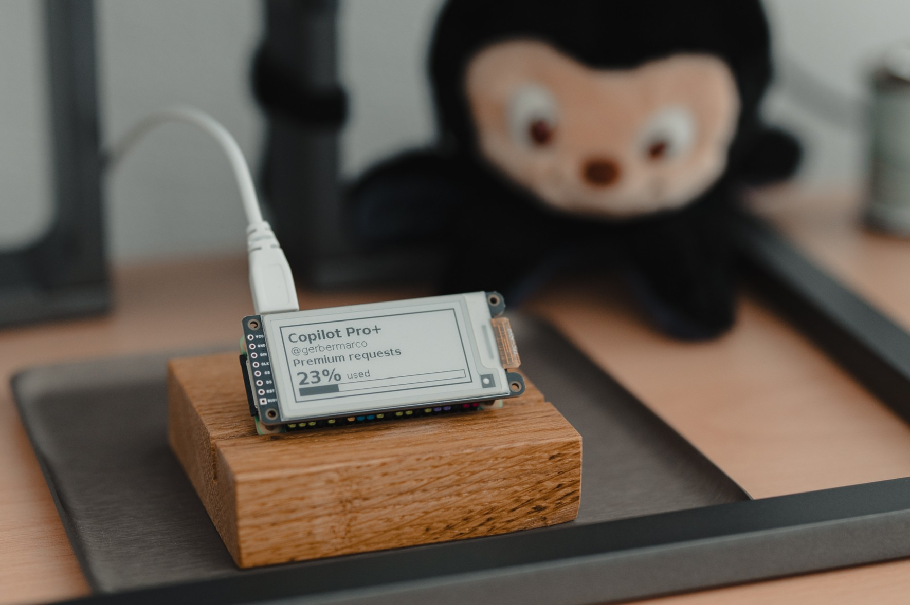

# GitHub Copilot Usage Display

A small Python application that fetches GitHub Copilot personal billing usage and renders a usage card to the console, a Waveshare 2.13 inch e-ink HAT+, or both.

Feel free to fork the repo and adapt it for your own display hardware or layout preferences.



## What It Shows

- E-ink-friendly compact card (VS Code-inspired)
- Copilot license label
- Username
- Premium request usage percentage and progress bar

## Data Source

This app uses the official user billing API endpoint:

- GET /users/{username}/settings/billing/premium_request/usage

Important scope note:

- User-level endpoints only return usage billed directly to a personal account.
- If your Copilot usage is billed through an organization or enterprise, personal results may be empty.

## Requirements

- Python 3.10+
- Fine-grained personal access token with user `Plan` permission set to read
- For e-ink mode: Pillow, waveshare-epaper (provides `waveshare_epd` drivers), and gpiozero

Notes on tokens:

- A classic PAT with only copilot scope is typically not sufficient for billing usage endpoints.
- If the token cannot access billing usage resources, GitHub may return 404.

## Raspberry Pi Setup

Run these one-time OS setup commands on a fresh Raspberry Pi OS install:

```bash
sudo apt update
sudo apt install -y python3-venv python3-pip python3-dev libgpiod2 libfreetype6-dev
```

Enable SPI for the e-ink HAT:

```bash
sudo raspi-config nonint do_spi 0
sudo reboot
```

## Setup

1. Clone the repository.
2. Create and activate a virtual environment.
3. Install dependencies.
4. Copy `.env.example` to `.env`
5. Edit `.env` to add your GitHub token and optionally adjust settings such as `OUTPUT_MODE`.

```bash
python3 -m venv .venv
. .venv/bin/activate
pip install -r requirements.txt
cp .env.example .env
```

## Run the app

```bash
python run.py
```

Optional CLI overrides:

```bash
python run.py --refresh-seconds 60
python run.py --output-mode console
python run.py --refresh-seconds 60 --output-mode both
```

CLI flags take precedence over `.env` values.

## Output Behavior

- `OUTPUT_MODE` controls where snapshots are rendered: `console`, `eink`, or `both`.
- The default is `both` to preserve the current combined terminal and e-ink behavior.
- Prints a compact VS Code-like usage card every refresh interval.
- If `COPILOT_MONTHLY_QUOTA` is missing, percentage shows as `N/A`.
- `OUTPUT_MODE=console` skips e-ink initialization entirely.
- `OUTPUT_MODE=eink` sends snapshot cards only to the e-ink display.
- On API failures, prints the last successful snapshot and includes the latest error.
- Stop with Ctrl+C.

## Limitations

- Percentage output depends on your manual `COPILOT_MONTHLY_QUOTA` value and is only as accurate as that configured quota.
- Org-managed or enterprise-managed billing is not included in personal endpoints.